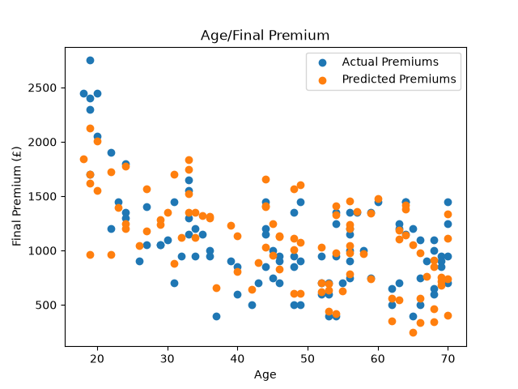

# Insurance Premium Prediction Model

## Overview:

This project predicts a customer's estimated Insurance Premium using Multiple Linear Regression Lines in Python, this is done by calculating the gradient and constant of these regression lines then subbing them back into the formula of an equation of a line to find the Estimated Insurance Premium for any given age. 

## Running the code: 

Before running this project, make sure Python is installed on your computer.

Install the required libraries before running the code: 

- pip install pandas openpyxl 
- pip matplotlib 
- pip install scikit-learn

Make sure the Excel Dataset is under the same folder as the code.  

## Insurance Premium Model:

The graph below shows the relationship between the age of the customer and the insurance premiums that they would be charged. The blue points represent the actual data, while the regression model estimates the average premium using multiple linear regression lines.

## Data:

The dataset used for this project was created in Excel using reasonable estimations to show the purpose of how the code works.

You can view or download the dataset here:

[Download the Excel Dataset](InsurancePricingData_v1.xlsx)

## The model uses:

- Age
- Years Driving
- Previous Claims
- Annual Mileage

to estimate an Insurance Premium.

## Skills Demonstrated:

## Programming
- Python
- Pandas
- Matplotlib
- Scikit-Learn
- Excel

## Mathematics
- Linear Regression
- Statistical Modelling
- Mathematical Modelling
- Quantative Anlysis

## Data Analysis
- Predictive Analysis
- Trend Analysis 
- Model Evaluation
- Regression Analysis

## Files:

analysis.py - Python code
InsurancePricingData_v1.xlsx - Dataset used for training the model
README.md
Insurance_Premium_Graph.png

## Author:

Karan Rooprai